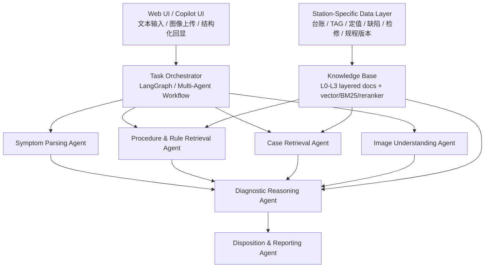
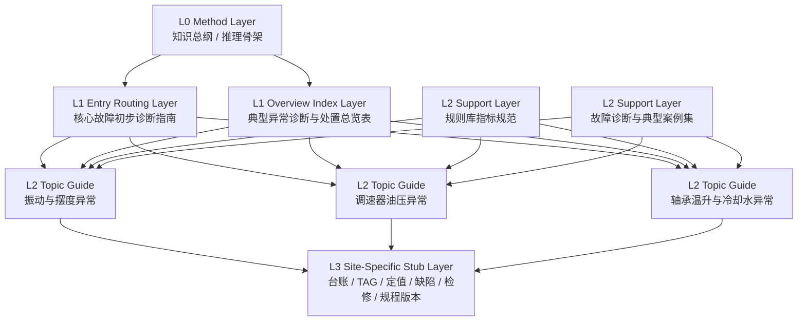

# Hydro O&M Copilot

Hydro O&M Copilot is an MVP knowledge-centric agent for hydro unit anomaly diagnosis and defect elimination assistance. It is designed for dispatcher, shift operator, and maintenance engineer workflows in hydropower plants.

## Version

Current repository baseline: `V0.0.1`

Current MVP status:

- Focused on RAG-first diagnosis assistance, not autonomous control.
- Focused on three high-frequency hydro unit anomaly topics.
- Built for prototype demonstration and progressive knowledge base iteration.

## Scope

### In Scope

- Hydro turbine-generator unit anomaly triage from natural language descriptions.
- Progressive disclosure from coarse symptom routing to topic-specific diagnosis guidance.
- Retrieval over internal diagnosis guides, rule base, and case base.
- Output of symptom extraction, root-cause ranking, missing confirmation items, inspection steps, risk reminders, and shift-report/draft defect text.
- Initial knowledge hooks for future station-specific data import.

### Current Topic Scope

1. Vibration and shaft swing anomalies.
2. Governor oil pressure and hydraulic control anomalies.
3. Bearing temperature rise and cooling-water anomalies.

### Out of Scope for V0.0.1

- Direct closed-loop control or protection action execution.
- Full online historian integration.
- Final operating instruction replacement for plant procedures.
- Broad equipment coverage outside the three current anomaly domains.
- High-confidence image-native diagnosis across arbitrary plant HMI screenshots.

## Product Goal

When an operator enters a hydro unit anomaly description, or uploads a trend chart/alarm screenshot, the system should assist with:

- Symptom extraction.
- Procedure/rule/case retrieval.
- Root-cause ranking.
- Recommended on-site inspection sequence.
- Risk reminders.
- Shift report and defect-ticket draft generation.

## Architecture

## Knowledge Base

The current knowledge base is intentionally layered for progressive disclosure and more precise RAG routing.

### Layer Definitions

- `L0`: methodology and inference design. Used to guide reasoning patterns and chunk taxonomy.
- `L1`: entry routing and overview index. Used to map user symptoms into the right diagnosis path.
- `L2`: topic diagnosis guides plus horizontal support documents for rules and cases.
- `L3`: station/unit-specific stubs reserved for future import of plant-specific operational knowledge.

### Current Document Map

| Layer | Role | Document |
| --- | --- | --- |
| L0 | Knowledge design and reasoning skeleton | `knowledge_base/docs_internal/水电机组 AI 智能诊断知识库构建指南.md` |
| L1 | Coarse triage router | `knowledge_base/docs_internal/水轮发电机组核心故障初步诊断指南.md` |
| L1 | Overview index | `knowledge_base/docs_internal/水电机组典型异常诊断与处置手册.md` |
| L2 | Topic guide | `knowledge_base/docs_internal/水电机组振动与摆度异常诊断与处置指南.md` |
| L2 | Topic guide | `knowledge_base/docs_internal/水电机组调速器油压异常诊断与处置指南.md` |
| L2 | Topic guide | `knowledge_base/docs_internal/水电机组轴承温升与冷却水异常诊断与处置指南.md` |
| L2 | Support rule base | `knowledge_base/docs_internal/水电站智能运维规则库指标规范.md` |
| L2 | Support case base | `knowledge_base/docs_internal/发电机组故障诊断与典型案例集.md` |
| L3 | Site-specific ingestion stubs | `knowledge_base/docs_internal/L3_现场化层_stubs/` |

## Progressive Disclosure Design

Each L0/L1/L2 document is being normalized with:

- `doc_id`
- `doc_level`
- `knowledge_type`
- `route_keys`
- `upstream_docs`
- `downstream_docs`
- `related_rules`
- `related_cases`
- `site_stub_refs`

This structure is intended to support:

- deterministic symptom routing before free-form generation
- topic-constrained retrieval
- explanation traceability
- easier future conversion into JSON or graph nodes

## L3 Site-Specific Stub Layer

The current MVP reserves templates for future plant/unit data import:

- Unit ledger.
- Tag mapping.
- Protection setpoints.
- Restricted load zones.
- Historical defects.
- Maintenance history.
- Procedure/version registry.

These stubs are placeholders only in `V0.0.1`, so the current MVP remains a generic hydro O&M copilot rather than a plant-locked expert system.

## Safety Positioning

This repository supports diagnosis assistance and draft generation. It does not replace plant procedures, relay protection logic, or operator responsibility. Any advice involving load reduction, shutdown, protection bypass, or emergency handling must be checked against plant-approved rules and real-time operating conditions.
