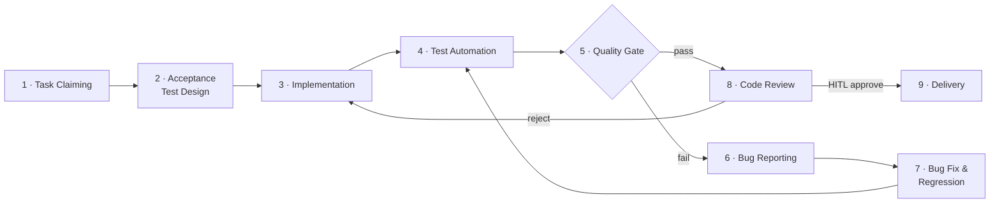

# Harness Engineering — 流程总索引

> 新 Agent 入队后的第二个读物（在 `agents/{self}/SOUL.md` 之后）。
> 定义完整开发循环的各阶段、负责 Agent、治理规程与当前状态。
> 标注 🔲 stub 的阶段已在流程中显性化，但规程尚未完善，可迭代补充。

---

## 开发循环



---

## 阶段总览

| # | 阶段 | 中文名 | 主责 Agent | 治理规程 | 状态 |
|---|---|---|---|---|---|
| 1 | Task Claiming | 任务认领 | claude_code / openai_codex | [requirement-standard](requirement-standard.md) §7–8 | ✅ active |
| 2 | Acceptance Test Design | 验收测试设计 | **openai_codex** | [testing-standard](testing-standard.md) §2.1–2.2 | ✅ active |
| 3 | Implementation | 功能实现 | **claude_code** | [requirement-standard](requirement-standard.md) §10.1 | ✅ active |
| 4 | Test Automation | 测试自动化 | claude_code | [testing-standard](testing-standard.md) §2.1–2.3 | ✅ active |
| 5 | Quality Gate | 质量门禁 | CI (automated) | [ci-standard](ci-standard.md) | 🔲 stub |
| 6 | Bug Reporting | 缺陷上报 | openai_codex / human | [bug-standard](bug-standard.md) §3–4 | ✅ active |
| 7 | Bug Fix & Regression | 缺陷修复与回归 | **claude_code** | [bug-standard](bug-standard.md) §6–7 | ✅ active |
| 8 | Code Review | 代码审查 | **openai_codex** + HITL | [review-standard](review-standard.md) | 🔲 stub |
| 9 | Delivery | 合并交付 | HITL (PR merge) | [requirement-standard](requirement-standard.md) §10.3 | ✅ active |

> **HITL checkpoint**：阶段 8→9 的 PR merge 必须人工确认，不允许自动合入。

---

## 规程文档索引

| 规程 | 文件 | 版本 | 状态 |
|---|---|---|---|
| 需求管理 | [requirement-standard.md](requirement-standard.md) | v0.3 | ✅ active |
| 测试规范 | [testing-standard.md](testing-standard.md) | v0.4 | ✅ active |
| Bug 管理 | [bug-standard.md](bug-standard.md) | v0.2 | ✅ active |
| 知识库入库 | [kb-ingestion-standard.md](kb-ingestion-standard.md) | v1.0 | ✅ active |
| 代码审查 | [review-standard.md](review-standard.md) | v0.1 | 🔲 stub |
| CI / 质量门禁 | [ci-standard.md](ci-standard.md) | v0.1 | 🔲 stub |

---

## Agent 分工速查

| Agent | 主导阶段 | 协作阶段 | Workspace |
|---|---|---|---|
| claude_code | 3 · Implementation, 4 · Test Automation, 7 · Bug Fix | 1 · Task Claiming | [agents/claude-code/](../agents/claude-code/SOUL.md) |
| openai_codex | 2 · Acceptance Test Design, 6 · Bug Reporting, 8 · Code Review | 1 · Task Claiming | [agents/openai-codex/](../agents/openai-codex/SOUL.md) |

---

## 任务目录

```
tasks/
  phases/       PHASE-xxx  迭代边界定义
  features/     REQ-xxx    功能需求项
  bugs/         BUG-xxx    缺陷报告
  test-cases/   TC-xxx     验收测试用例（先于实现创建）
  archive/
    done/                  已完成
    cancelled/             已废弃
```

---

## 自动化流程（Git-Native Orchestration）

当前阶段采用 Git-Native 方式驱动循环，不依赖常驻服务：

```
PR merged to main
    └─▶ GitHub Action: scripts/agent-loop.py  [🔲 stub]
            └─▶ 扫描 tasks/features/：status=test_designed, owner=unassigned
            └─▶ 调用 claude -p 认领并实现
            └─▶ claude_code 开 Draft PR
            └─▶ openai_codex review
            └─▶ HITL 确认 merge → 循环
```

> `scripts/agent-loop.py` 当前为 stub，触发机制在 [ci-standard](ci-standard.md) 中定义后接入。

---

## 变更日志

| 版本 | 日期 | 变更摘要 |
|---|---|---|
| 0.1 | 2026-03-12 | 初始版本；定义完整开发循环、阶段总览、规程索引、Agent 分工和 Git-Native 编排机制 |
